# HalkaPan

  *Halkapan is a website where you can express your feelings,confession, thoughts, desire  in a form of blog and reach out large number of audition and get their love and feedback.*

Video URL : [Short Presentation](https://youtu.be/-Uu4BNHXKTE/)

## Features

Some of the important features of the system are as follows:

* User can create post either publicly or anonymously.
* User can perform CRUD (Create, Retrieve, Update, Delete) operation on Post
* User can follow other user can get the content from those users through feed system.
* Users react and comment on post.
* Tags can be assigned to the post.
* Admin User can perform all action through admin dashboard

## Getting Started

1. Clone the repo using `git clone https://github.com/rijalanupraj/halkapan.git`.
2. First of all install all the required python packages from requirements.txt file. You can run `pip install -r requirements.txt` to install those packages.
3. Import `halkapan.sql` on mysql or you can use your own database don't forget to change it on settings.py file.
4. Put you email and password in settings.py file.

## Technologies Used

1. Python
2. Django
3. HTML
4. CSS
5. JS
6. AJAX
7. MySql

## Screenshots

### Home Page

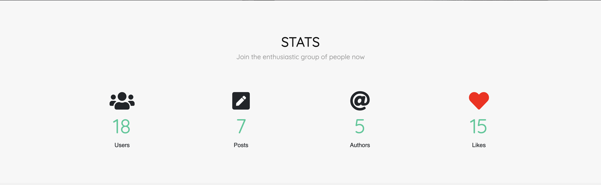

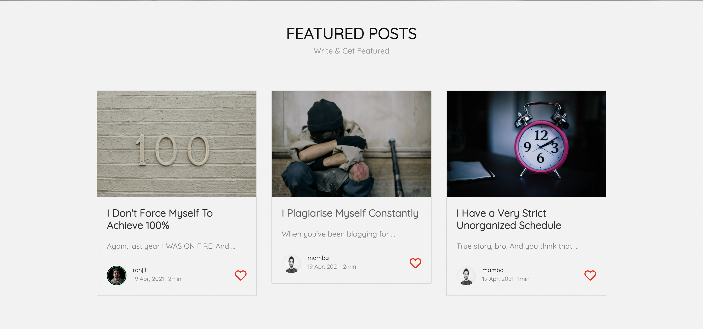
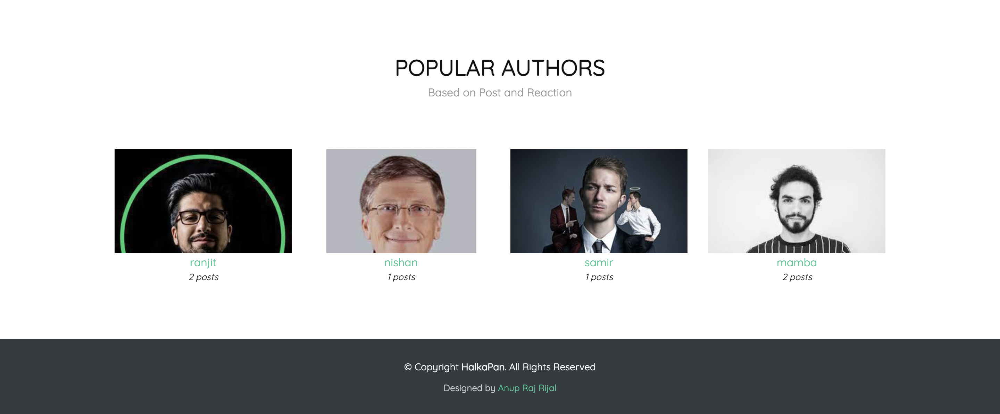

### Sidebar

### Login & Register

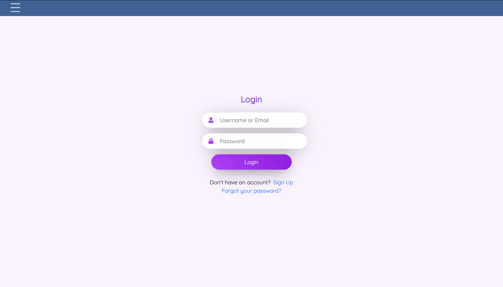
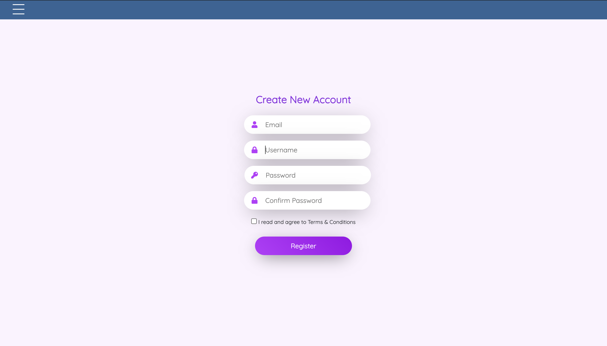

### Explore

### Feed

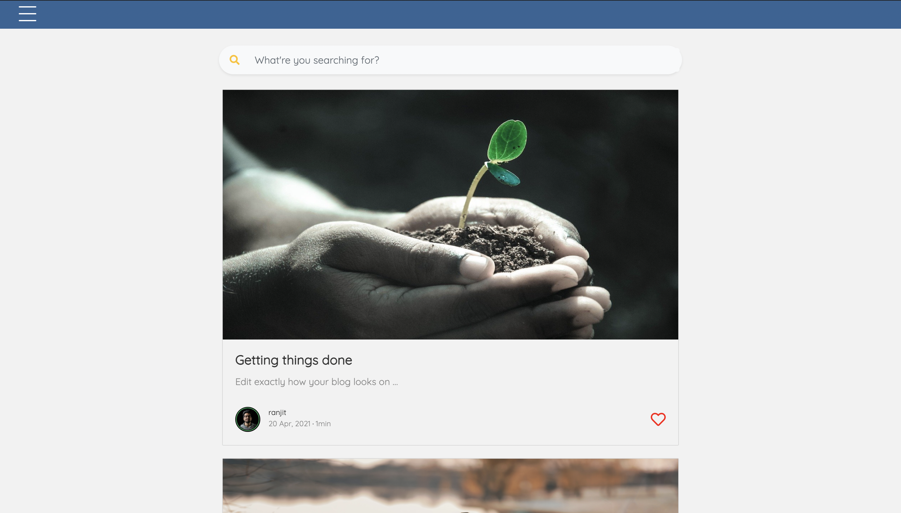

### All Users

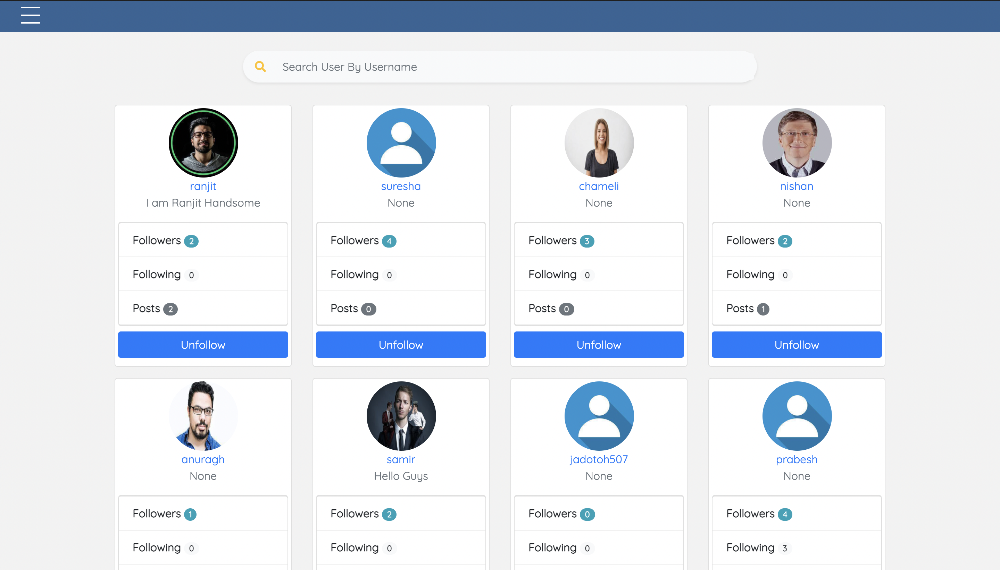

### Author Page

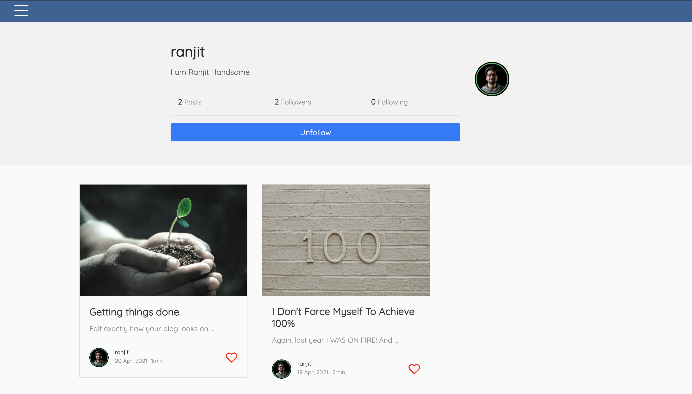

### New Post

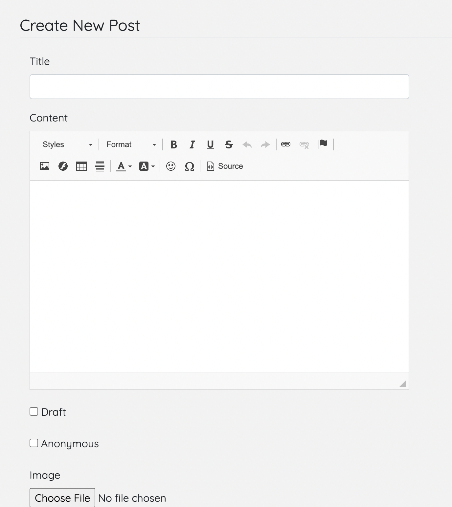

### Post Detail

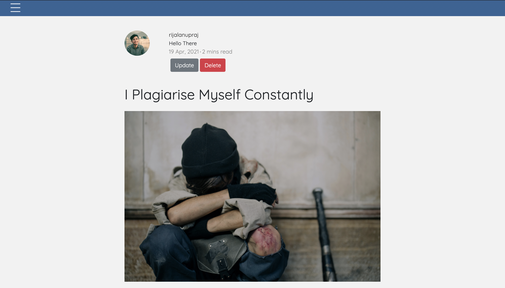
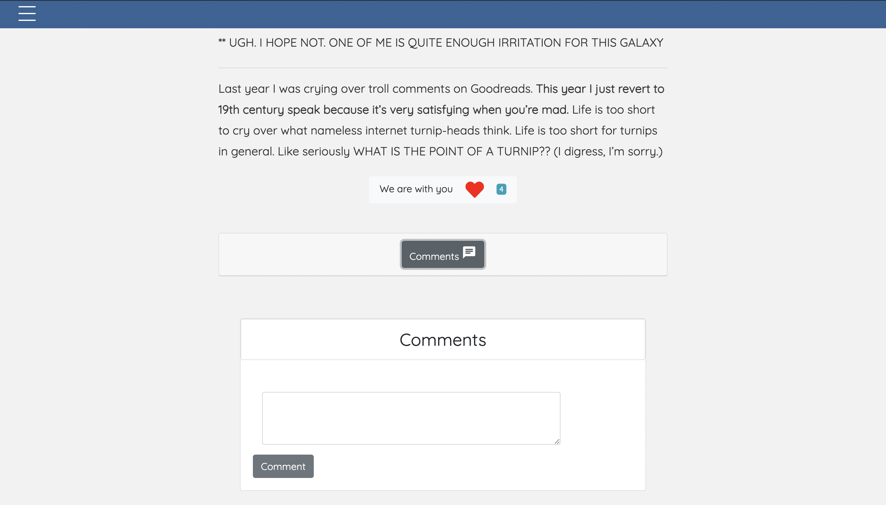
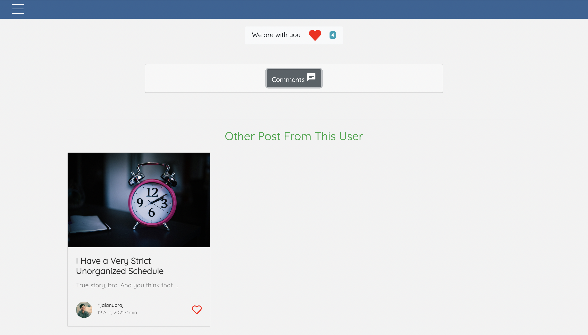

### Admin Dashboard

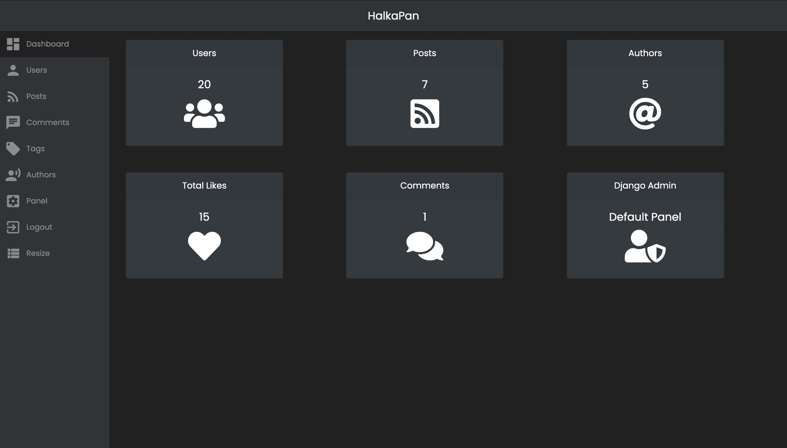
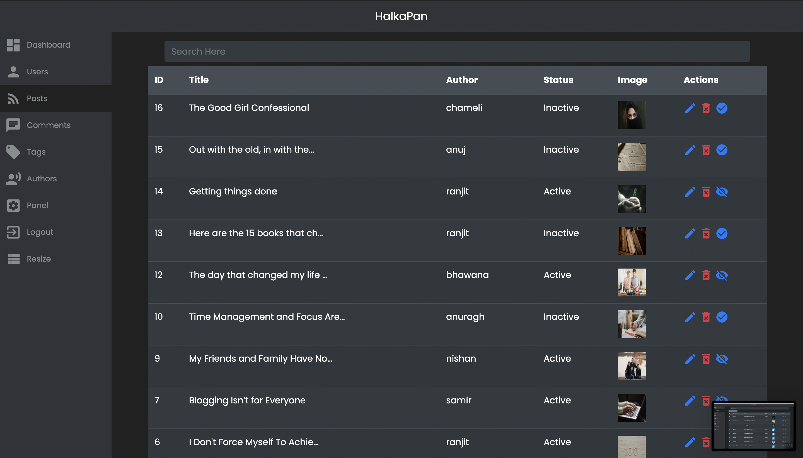
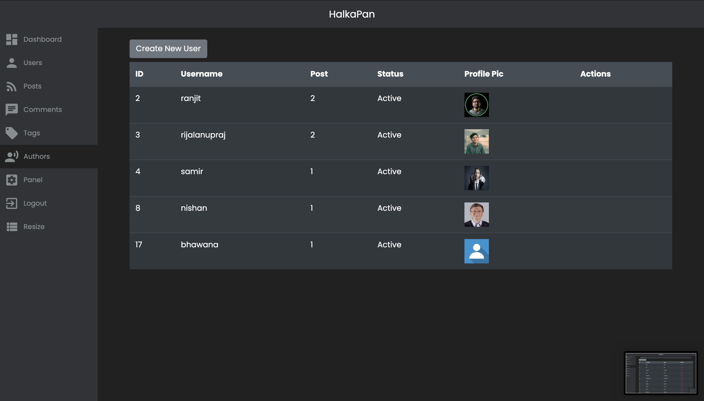
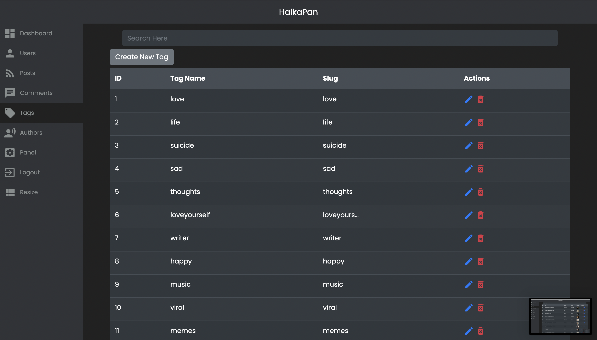
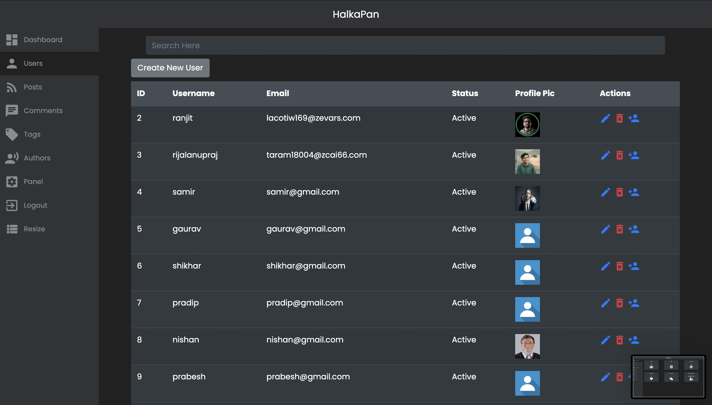

Special Thanks To: Pradip Kandel & Aakash Karmacharya
